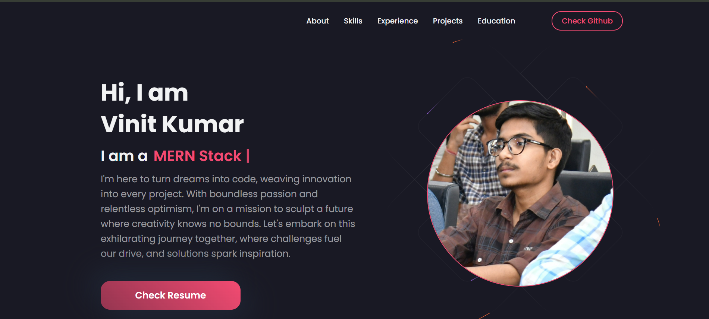

# Portfolio


## 🔮 Features
-   📝 Directly see and download my resume.
-   🧑‍💻 Anyone can check my skills, experience, projects, eduction, gtihub profile.
-   🚀 filter projects on the basis of tech stacks.
-   📬 Directly send feedback without any login
-   🌍 directly switch to section using navigation bar buttons.

## 🚀 Live Preview

You can view the live preview of this project [here](https://portfolio-ten-vert-47.vercel.app/). 

## 💻 Tech Stack


<details>
    <summary>
        <h2>📂 Folder Structure</h2>
    </summary>

```
client/
├── public/
│   ├── favicon/ 
|   ├──index.html
│   │   └── ...
├── src/
│   ├── components/
│   │   ├── About/
│   │   │   ├── AboutStyle.js
│   │   │   └── index.js
│   │   ├── cards/
│   │   │   ├── EducationCard.jsx
│   │   │   ├── ExperienceCard.jsx
│   │   │   └── ProjectCards.jsx
│   │   ├── contact/
│   │   │   └── index.js
│   │   ├── Darkmode/
│   │   │   └── ThemeMode.js
│   │   ├── Education/
│   │   │   └── index.js
│   │   ├── Experience/
│   │   │   └── index.js
│   │   ├── Footer/
│   │   │   └── index.js
│   │   ├── HeroBgAnimation/
|   |   |   ├── index.js
│   │   │   └── HeroBgAnimationStyle.js
│   │   ├── HeroSection/
|   |   |   ├── index.js
│   │   │   └── HeroStyle.js
│   │   ├── Navbar/
|   |   |   ├── index.js
│   │   │   └── NavbarStyledComponent.js
│   │   ├── ProjectDetails/
│   │   │   └── index.js
│   │   ├── Projects/
|   |   |   ├── index.js
│   │   │   └── ProjectStyle.js
│   │   ├── Skills/
|   |   |   ├── index.js
│   │   │   ├── skillProgress.css
│   │   │   └── skillProgress.js
│   ├── data/
│   │   └── data.jsx
│   ├── images/
│   │   └── heroImage.jpg
│   ├── pages/
│   │   ├── EditorPage.jsx
│   │   └── HomePage.jsx
│   ├── themes/
│   │   └── default.js
│   ├── utils/
│   │   └── themes.js
│   ├── App.css
│   ├── App.js
│   └── index.js
├── .env
├── .gitignore
├── package-lock.json
├── package.json
├── preview.png
└── tailwind.config.js


README.md
```

</details>


## ⚙️ Installation

1. **Fork this repository:** Click the Fork button located in the top-right corner of this page to fork the repository.
2. **Clone the repository:**
    ```bash
    git clone https://github.com/<your-username>/Portfolio.git
    ```
3. **Install dependencies:**
   Navigate to the frontend and backend directories separately and run:
    ```bash
     npm install
    ```
4. **Start the frontend and backend servers:**  
    ```bash
    cd client
    npm run start
    ```
5. **Access the application:**
   Open a browser and enter the following URL:
    ```bash
    http://localhost:3000/
